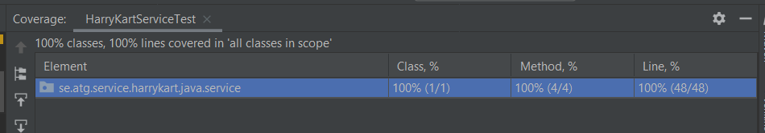
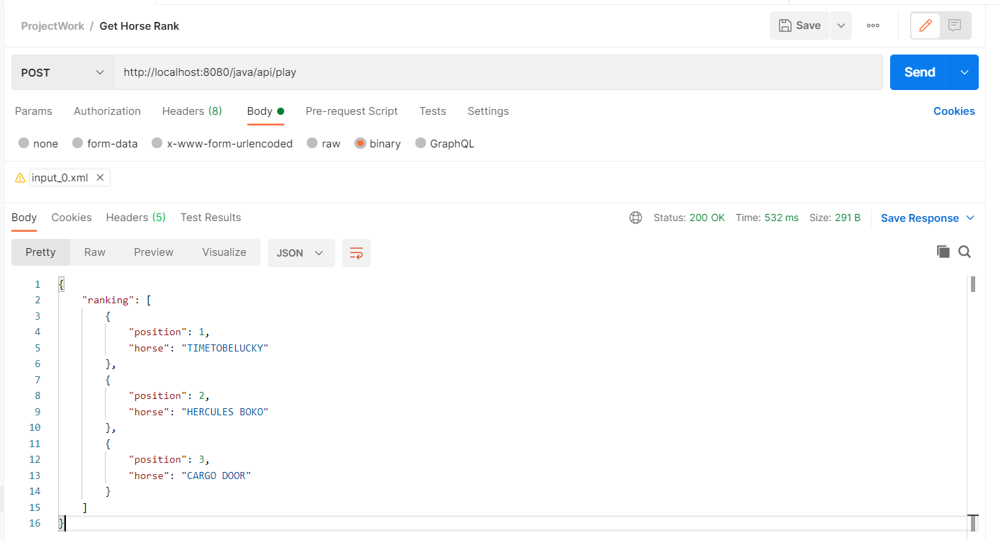
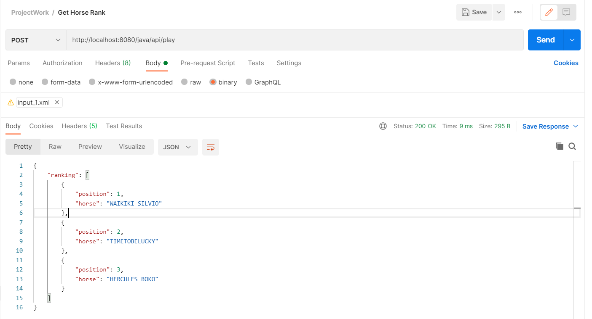
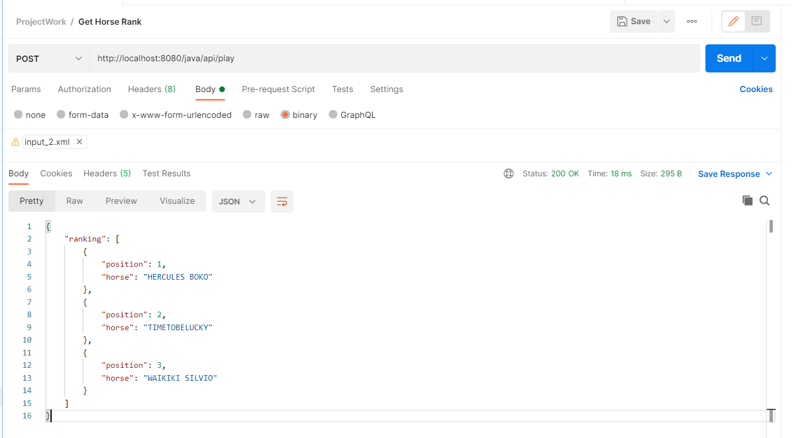

# Harry-Kart
## Description
Harry-Kart Horse Race Implementation

This implementation logic has been tested in all possible scenarios and test coverage is 100% for service class (HarryKartServiceTest.java).


Below is the result of each example given:

Example 1:
------------

Used xml file is **input_0.xml**

```json
{
    "ranking": [
        {
            "position": 1,
            "horse": "TIMETOBELUCKY"
        },
        {
            "position": 2,
            "horse": "HERCULES BOKO"
        },
        {
            "position": 3,
            "horse": "CARGO DOOR"
        }
    ]
}
```


Example 2:
-------------
Used xml file is **input_1.xml**

```json
{
    "ranking": [
        {
            "position": 1,
            "horse": "WAIKIKI SILVIO"
        },
        {
            "position": 2,
            "horse": "TIMETOBELUCKY"
        },
        {
            "position": 3,
            "horse": "HERCULES BOKO"
        }
    ]
}
```


Example 3:
------------
Used xml file is **input_2.xml**
```json
{
    "ranking": [
        {
            "position": 1,
            "horse": "HERCULES BOKO"
        },
        {
            "position": 2,
            "horse": "TIMETOBELUCKY"
        },
        {
            "position": 3,
            "horse": "WAIKIKI SILVIO"
        }
    ]
}
```



Build:
------
For building, use the maven build command (mvn clean install)

Api url is _**http://localhost:8080/java/api/play**_ (POST)